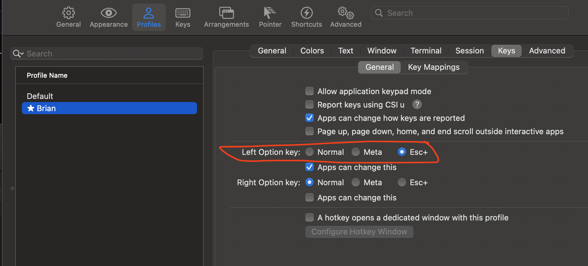

# dotfiles
Brian's environment setup across multiple machines (chezmoi)

## To setup on a new machine

```
/bin/zsh -c \
  "$(curl -fsSL https://raw.githubusercontent.com/brianmgray/dotfiles/main/bin/new-env.sh) \
  --all"
chezmoi init --ssh --apply brianmgray       # pulls latest dotfiles from github 
setup                                       # setup runs a setup script to install/update all necessary tools 
```

In iTerm, change the Profile font to MesloLGS NF. Also enable this option for broot:


## For more

[Chezmoi user guide](https://www.chezmoi.io/user-guide/setup)
