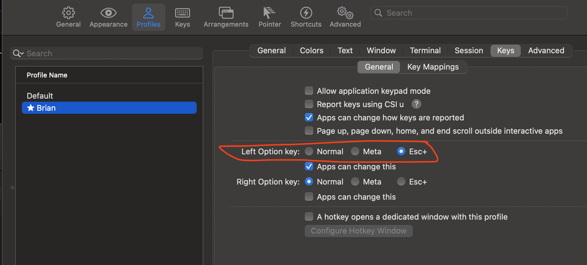

# dotfiles
Brian's environment setup across multiple machines (chezmoi)

## To setup on a new machine

```
/bin/zsh -c \
  "$(curl -fsSL https://raw.githubusercontent.com/brianmgray/dotfiles/main/bin/new-env.sh) \
  --all"
chezmoi init --ssh --apply brianmgray       # pulls latest dotfiles from github 
setup                                       # setup runs a setup script to install/update all necessary tools 
```

In iTerm, change the Profile font to MesloLGS NF. Also enable this option for broot:


## Claude reset

This automation wakes the Mac at 5:00 AM and sends a trivial Claude Code message. The goal is to start a Claude Code usage window before the workday begins so the session reset occurs earlier in the day.

### 1. Configure the Mac to wake at 5:00 AM

Run once:

```bash
sudo pmset repeat wakeorpoweron MTWRFSU 05:00:00
```

Verify:

```bash
pmset -g sched
```

### 2. Check files

Chezmoi should restore:
- `~/Library/LaunchAgents/com.bgray.claude-reset.plist
- ~/.local/share/chezmoi/bin/claude-reset.sh

### 3. Load the launch agent

```bash
launchctl load ~/Library/LaunchAgents/com.bgray.claude-reset.plist
```

### 4. Test

Run the script manually:

```bash
~/.local/share/chezmoi/bin/claude-reset.sh 
```

Confirm that Claude responds and that the command uses the expected Claude Code account and quota window.

## For more

[Chezmoi user guide](https://www.chezmoi.io/user-guide/setup)
